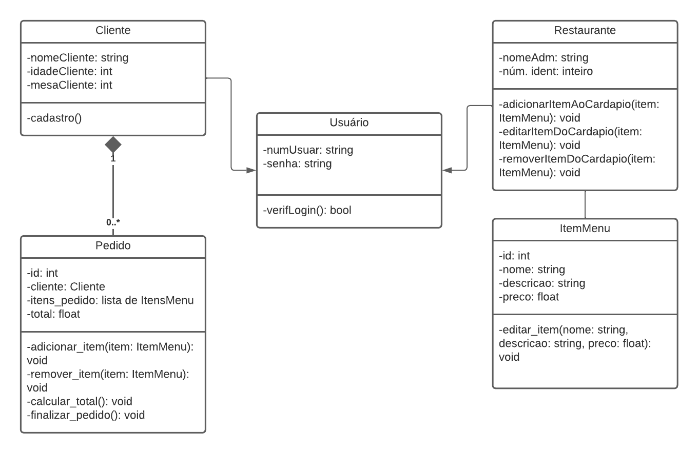
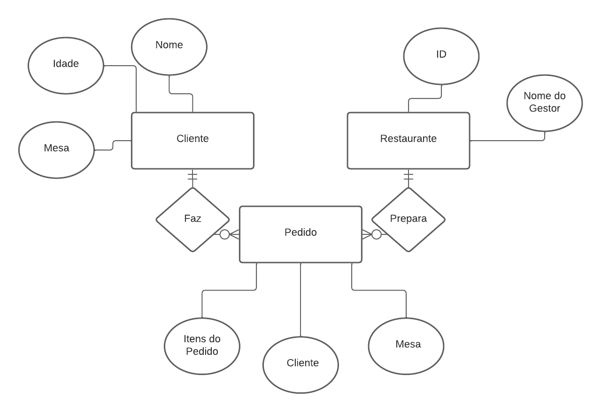
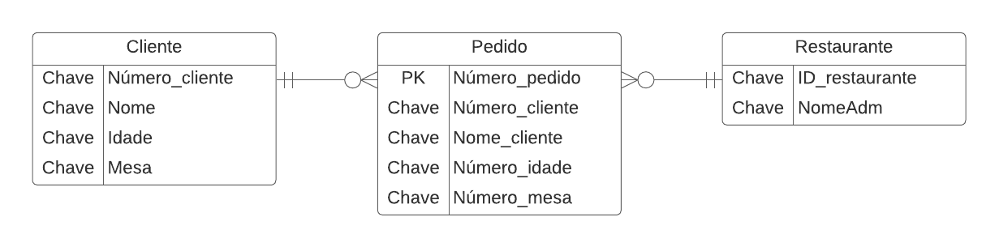

# Arquitetura da Solução

Pré-requisitos: <a href="3-Projeto de Interface.md"> Projeto de Interface</a>

Definição de como o software é estruturado em termos dos componentes que fazem parte da solução e do ambiente de hospedagem da aplicação.

## Diagrama de Classes

O diagrama de classes ilustra graficamente como será a estrutura do software, e como cada uma das classes da sua estrutura estarão interligadas. Essas classes servem de modelo para materializar os objetos que executarão na memória.

## Modelo ER

O Modelo ER representa através de um diagrama como as entidades (coisas, objetos) se relacionam entre si na aplicação interativa.]

## Esquema Relacional

O Esquema Relacional corresponde à representação dos dados em tabelas juntamente com as restrições de integridade e chave primária.
 

## Modelo Físico

Entregar um arquivo banco.sql contendo os scripts de criação das tabelas do banco de dados. Este arquivo deverá ser incluído dentro da pasta src\bd.

## Tecnologias Utilizadas

Linguagens de Programação: JavaScript e SQL.
Framework: React Native.
Biblioteca: React Native Paper.
IDEs: Expo Snack e Visual Studio Code.
Ferramentas: Expo, Expo Go.

## Hospedagem

Explique como a hospedagem e o lançamento da plataforma foi feita.

> **Links Úteis**:
>
> - [Website com GitHub Pages](https://pages.github.com/)
> - [Programação colaborativa com Repl.it](https://repl.it/)
> - [Getting Started with Heroku](https://devcenter.heroku.com/start)
> - [Publicando Seu Site No Heroku](http://pythonclub.com.br/publicando-seu-hello-world-no-heroku.html)

## Qualidade de Software

| **Subcaracterísticas de Qualidade de Software.** | **Justificativa**                                                                                          | **Métrica**                                                                      |
| ------------------------------------------------ | ---------------------------------------------------------------------------------------------------------- | -------------------------------------------------------------------------------- |
| Integridade funcional                            | O software deve ser capaz de manter a funcionalidade de todas as tarefas que realiza.                      | O software realiza todas as tarefas disponíveis?                                 |
| Comportamento temporal                           | Tempo de resposta e processamento.                                                                         | O software possui tempo de resposta satisfatório?                                |
| Capacidade de aprendizado                        | O software deve facilitar o aprendizado do usuário de como utilizá-lo.                                     | O software é simples de ser utilizado?                                           |
| Estética da interface                            | O software deve ter uma interface agradável                                                                | A interface do software é agradável?                                             |
| Disponibilidade                                  | O software e seus componentes devem está acessível e operante.                                            | O software está sempre acessível e operante?                                     |
| Confidencialidade                                | O sistema deve ser capaz de garantir que dados são acessados apenas por aqueles que têm acesso autorizado. | O sistema permite o acesso apenas por usuários autorizados?                      |
| Testabilidade                                    | Efetividade de testes para o sistema, produto ou componente.                                               | Os testes foram satisfatórios?                                                   |
| Facilidade de instalação                         | Capacidade de um produto ou sistema ser instalado ou desinstalado facilmente.                              | Qual o nível de capacidade do software ser instalado ou desinstalado facilmente? |
